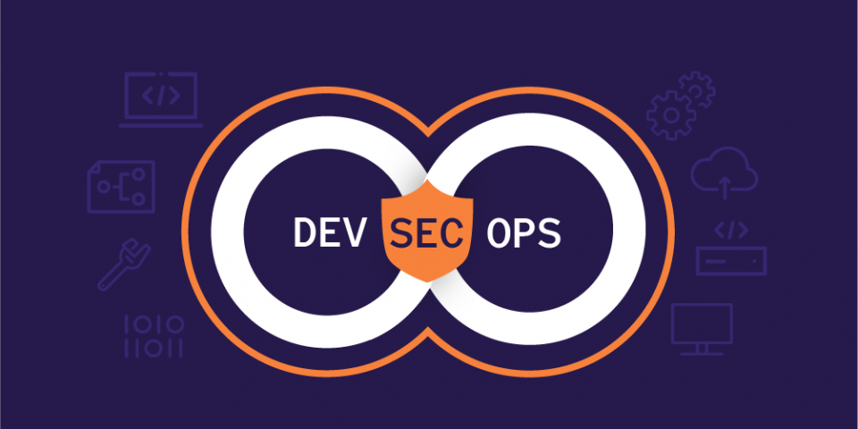


# Overview

DevOps is the practice of developing software that integrates software development and IT operations to deliver software faster and ensure continuous delivery with high quality. However, security often becomes an afterthought when designing and managing a CI/CD pipeline, infrastructure, etc., for deploying large-scale applications. Therefore, it is important to incorporate security in every step of the Software Development Life Cycle (SDLC). DevSecOps is the practice of automating security throughout the SDLC by combining development, operations, and security into a single pipeline.

In this project, we will build a complete CI/CD pipeline for a microservice application as most large-scale software follows microservice architecture nowadays. More importantly, we will include several security tools that can conduct security scans at various stages of the pipeline. Finally, we will setup monitoring and notification services.


# Table of Contents
- [Overview](#overview)
- [Table of Contents](#table-of-contents)
    - [AWS Services](#aws-services)
    - [Monitoring Tools](#monitoring-tools)
    - [Frameworks](#frameworks)
    - [Database](#database)
    - [Security Tools](#security-tools)
  - [Application Architecture](#application-architecture)
  - [AWS Architecture](#aws-architecture)
  - [Application Source Code](#application-source-code)
- [Prerequisites](#prerequisites)
  - [EC2 Instance](#ec2-instance)
  - [AWS CLI setup](#aws-cli-setup)
  - [Kubectl setup](#kubectl-setup)
  - [Terraform Setup](#terraform-setup)
  - [EKS and RDS Cluster Provisioning with Terraform](#eks-and-rds-cluster-provisioning-with-terraform)
    - [EKS-auth ConfigMap](#eks-auth-configmap)
  - [ECR (Elastic Container Registry) Setup](#ecr-elastic-container-registry-setup)
  - [S3 Bucket Configuration](#s3-bucket-configuration)
  - [Security Scan Logs collection with AWS Lambda](#security-scan-logs-collection-with-aws-lambda)
  - [Security Hub](#security-hub)
  - [Notification Tools](#notification-tools)
    - [Simple Notification Service (SNS)](#simple-notification-service-sns)
    - [Simple Email Service (SES)](#simple-email-service-ses)
- [The Pipeline](#the-pipeline)
  - [GitHub Conection](#github-conection)
  - [CodeCommit Configuration](#codecommit-configuration)
  - [System Manager - Parameter Store](#system-manager---parameter-store)
  - [CodeBuild Project Configuration](#codebuild-project-configuration)
    - [CodeBuild Service Role](#codebuild-service-role)
    - [Trust Relationship](#trust-relationship)
    - [IAM Permission Policies for CodeBuild](#iam-permission-policies-for-codebuild)
      - [AWS Managed Policy](#aws-managed-policy)
      - [Customer Managed Policy](#customer-managed-policy)
      - [Auto Generated Policy](#auto-generated-policy)
  - [CodePipeline Configuration](#codepipeline-configuration)
    - [CodePipeline Service Role](#codepipeline-service-role)
    - [Trust Relationship](#trust-relationship-1)
    - [IAM Permission Policies for CodePipeline](#iam-permission-policies-for-codepipeline)
      - [Auto Generated Policy](#auto-generated-policy-1)
      - [Sonarqube Installation](#sonarqube-installation)
    - [SonarQube Project Setup](#sonarqube-project-setup)
    - [SonarQube Quality Gate Setup](#sonarqube-quality-gate-setup)
- [Monitoring with Prometheus and Grafana](#monitoring-with-prometheus-and-grafana)
- [Autoscaling with metrics server](#autoscaling-with-metrics-server)
- [Security Vulnerability Fixing Before / After](#security-vulnerability-fixing-before--after)
  - [**Docker Image Vulnerability scanning with Trivy (Before)**](#docker-image-vulnerability-scanning-with-trivy-before)
  - [**Docker Image Vulnerability Solve scanning with Trivy (After fixing Vulnerability)**](#docker-image-vulnerability-solve-scanning-with-trivy-after-fixing-vulnerability)
  - [**Docker Image scanning with Trivy (Pipeline Fail when Critical Vulnerability found)**](#docker-image-scanning-with-trivy-pipeline-fail-when-critical-vulnerability-found)
  - [**Quality Gate Condition checking Vulnerability with SonarQube (Pipeline Failed)**](#quality-gate-condition-checking-vulnerability-with-sonarqube-pipeline-failed)
  - [**Quality Gate Condition checking Vulnerability with SonarQube (Pipeline Passed after fixing Vulnerability)**](#quality-gate-condition-checking-vulnerability-with-sonarqube-pipeline-passed-after-fixing-vulnerability)
  - [**OWASP ZAP Report Before**](#owasp-zap-report-before)
  - [**OWASP ZAP Report After**](#owasp-zap-report-after)


### AWS Services

For the project you might require basic knowledge of the following tools and services:

- IAM (Identity and Access Management)
- S3 (Simple Storage Service)
- ECR (Elastic Container Registry)
- AWS DevTools (e.g. CodeCommit, CodBuild, CodePipeline)
- EKS (Elastic Kubernetes Service)
- SNS (Simple Notification Service)
- SES (Simple Email Service)
- Route 53
- EC2 (Elastic Compute Cloud)
- Lambda
- Security Hub
- System Manager (Parameter Store)
- RDS (Relational Database Service)

### Monitoring Tools

- Prometheus
- Grafana
- Prometheus-Operator

### Frameworks

- Laravel
- NextJs

### Database

- MySQL


### Security Tools

In this project we used several popular security tools such as `PHPStan`, `SonarQube`, `OWASP Dependency-Check`, `Trivy` and `OWASP ZAP`. Let's briefly discuss each of them.

**PHPStan**

PHPStan is a static analysis system for PHP projects. It scans your entire codebase and looks for both obvious and tricky bugs, even in rarely executed if statements that aren’t covered by tests. It can be run on your machine and in CI to prevent bugs from reaching your customers in production. PHPStan is open-source, free, and offers extensions for popular frameworks like Symfony, Laravel, or Doctrine. It also understands code that takes advantage of magic methods and properties.

**Sonarqube**

SonarQube is an open-source platform for continuous inspection of code quality and security. SonarQube identifies code smells, bugs, security vulnerabilities, and code duplications in your source code. It supports a large number of programming languages, including Java, C/C++, Python, JavaScript, and more. SonarQube can be integrated into CI/CD pipelines to automate code quality and security checks at various stages of development. It generates detailed reports and provides a dashboard for visualizing code quality and security issues. SonarQube is used by development teams to maintain and improve the overall quality and security of their codebases. It helps identify and fix issues early in the development process, reducing technical debt and the risk of security vulnerabilities.

**OWASP Dependency Check**

OWASP Dependency Check is a Software Composition Analysis (SCA) tool that detects publicly disclosed vulnerabilities contained within a project’s dependencies. It does this by determining if there is a Common Platform Enumeration (CPE) identifier for a given dependency. If found, it generates a report linking to the associated CVE entries. Dependency Check can be used to scan applications (and their dependent libraries) to identify any known vulnerable components. It helps address the problem of using known vulnerable components in applications, which can pose security risks.

**Trivy**

Trivy is an open-source vulnerability scanner designed specifically for containerized applications. It focuses on scanning container images and filesystems for security vulnerabilities.Trivy can scan Docker containers and OCI (Open Container Initiative) images.It maintains a comprehensive database of Common Vulnerabilities and Exposures (CVE) to identify known vulnerabilities.Trivy is known for its speed and simplicity, making it easy to integrate into CI/CD pipelines.Trivy is typically used by DevOps and security teams to ensure the security of containerized applications by identifying and mitigating vulnerabilities in container images. It is often integrated into CI/CD pipelines to automate security checks during the build and deployment process.

**OWASP ZAP**

OWASP ZAP (Zed Attack Proxy) is the world’s most widely used web app scanner. It is a free and open-source tool actively maintained by a dedicated international team of volunteers. ZAP helps identify security vulnerabilities in web applications by scanning them for potential weaknesses. It provides a range of options for security automation and has add-ons contributed by the community to extend its functionality.


## Application Architecture

The following image displays the architecture of a microservice applicaiton

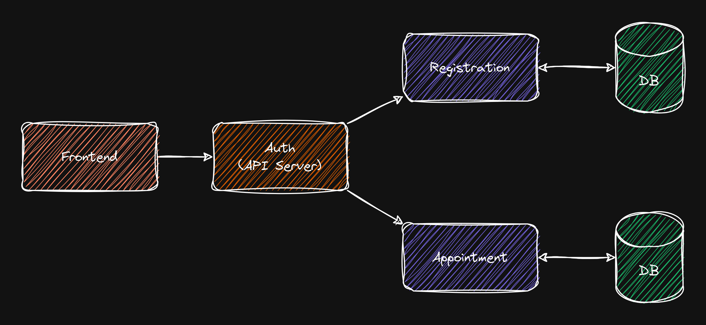

## AWS Architecture

The following image potrays the architecture of the entire infrastructure in AWS.

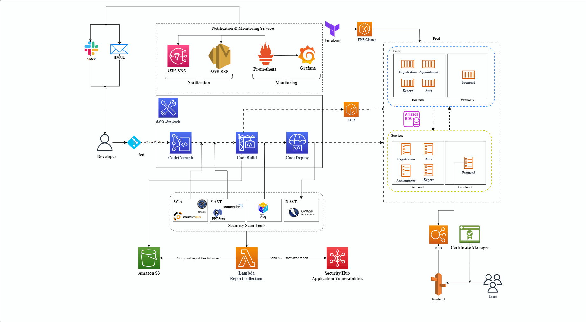

## Application Source Code

[Registration-service](https://github.com/samin-bjit/vaccination-registration)

[Frontend](https://github.com/samin-bjit/vaccination-frontend)

[Auth-service](https://github.com/samin-bjit/vaccination-auth)

[Appointment-service](https://github.com/samin-bjit/vaccination-appointment)

Fork the above repositories into your own github account.

# Prerequisites

Before we can build a pipeline to deploy our application we need to prepare several things. These include Installing required tools, EKS and RDS cluster provisioning for our deployment environment and creating IAM roles for building the pipeline.

## EC2 Instance

**Step 1:** Go to EC2 > Click on "Launch Instance".

**Step 2:**  Give a name and select the OS image (e.g, Ubuntu)

**Step 3:** Select the Amazon Machine Image (AMI) -->(free tier eligible)

**Step 4:** Choose the Instance type accoridng to your project requirements(Used t2.medium for this project)

**Step 5:** Click on "Create a new Key Pair" to securely connect to your instance. Ensure that you have access to the selected key pair before you launch the instance.

**Step 6:** Select the VPC, Subnet and Auto-assign public IP or you can choose default configurations.

**Step 7:** Create a security group and allow some required ports (e.g, port:22, port:8000 and port:9000)

**Step 8:** Finally, launch the instance.

## AWS CLI setup

For various tasks in this project we will need to interact with AWS services and resources from our local machine. Therefore, we need to install AWS CLI and configure it properly in our system. Follow the steps below for installing and configuring the AWS CLI.

> **Note:** If you are using an EC2 instance with Amazon linux images aws cli should already be installed in the system. In that case, skip the installations steps.

**Step 1:**  Make sure `curl` and `unzip` is installed in the system.

**For Ubuntu/Debian:**

```bash
sudo apt update && sudo apt-get install -y curl unzip
```

**For RHEL:**

```bash
sudo yum install -y curl unzip
```

**Step 2:** Download the install script for aws-cli

```bash
curl "https://awscli.amazonaws.com/awscli-exe-linux-x86_64.zip" -o "awscliv2.zip"
```

**Step 3:** Unzip and run the install script.

```bash
unzip awscliv2.zip

sudo ./aws/install
```

**Step 4:** Run the following command to check the version of installed aws cli:

```bash
aws --version
```

**Step 5:** Run the following command to start configuring AWS CLI.

```bash
aws configure
```

**Step 6:** For configuring the aws cli you will need an Access key and Secret access key pair associated with your account. If you don't have an access key, login to your aws account and go to security credentials.

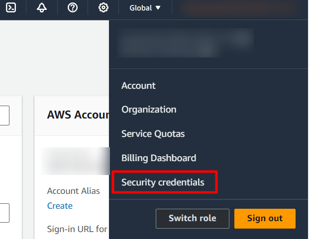

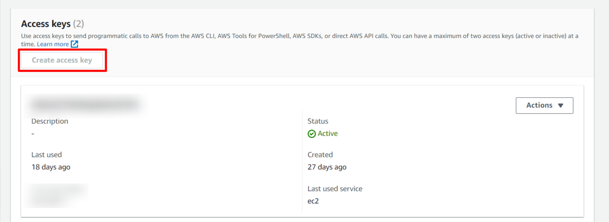

Create an access key for aws command line interface. Download the access key after generation and save it in a safe place because the secret key can't be obtained later.

**Step 7:** Use the access key and secret access key to configure the AWS CLI. The configuration should look like the image below.


## Kubectl setup

To interact with the EKS cluster we will need `kubectl`. Follow the steps below:

**Step 1:** Run the following command to download kubectl binary.

```bash
curl -LO "https://dl.k8s.io/release/$(curl -L -s https://dl.k8s.io/release/stable.txt)/bin/linux/amd64/kubectl"
```

**Step 2:**  Afterwards, run the following command to install kubectl as the root user.

```bash
sudo install -o root -g root -m 0755 kubectl /usr/local/bin/kubectl
```

**Step 3:** Check `kubectl` is working by running a version check

```bash
kubectl version --client
```

## Terraform Setup

We need terraform to setup an EKS and RDS cluster for this project. Follow the steps below to setup terraform:

**For Ubuntu/Debian:**

**Step 1:** Install  `gnupg`, `software-properties-common`, and `curl` packages by running the following commands.

```bash
sudo apt-get update && sudo apt-get install -y gnupg software-properties-common
```

**Step 2:**  Install HashiCorp GPG Key

```bash
wget -O- https://apt.releases.hashicorp.com/gpg | \

gpg --dearmor | \

sudo tee /usr/share/keyrings/hashicorp-archive-keyring.gpg
```

**Step 3:** Add the HashiCorp repository to your package manager.

```bash
echo "deb [signed-by=/usr/share/keyrings/hashicorp-archive-keyring.gpg] \

https://apt.releases.hashicorp.com $(lsb_release -cs) main" | \

sudo tee /etc/apt/sources.list.d/hashicorp.list
```

**Step 4:** Update packages and install Terraform.

```bash
sudo apt update && sudo apt-get install terraform
```

**For RHEL:**

**Step 1:** Install `yum-utils` package.

```bash
sudo yum install -y yum-utils
```

**Step 2:** Use `yum-config-manager` to add HashiCorp repository to your package manager.

```bash
sudo yum-config-manager --add-repo https://rpm.releases.hashicorp.com/RHEL/hashicorp.repo`
```

**Step 3:** Finally, install terraform from the newly added repository

```bash
sudo yum -y install terraform
```

## EKS and RDS Cluster Provisioning with Terraform

Assuming you have already installed and setup `terraform`, `aws-cli` & `kubectl` we can provision the EKS and RDS Cluster using the provided terraform code.

**Step 1:** Clone the terraform code repo

```bash
git clone https://github.com/samin-bjit/AWS_DevSecOps_Infra_Monitor_Configs.git
```

**Step 2:** Go to `terraform` directory and open and edit `variables.tf` file. Change the region to your current one.

**Step 3:** Next, run the following command to intiate the backend.

```bash
terraform init
```

**Step 4:** Next, run the following command to generate a plan before provisioning

```bash
terraform plan
```

**Step 5:** Thoroughly check the plan and run the following command to apply and start the provisioning process.

```bash
terraform apply -auto-approve
```

**Step 6:** After provisioning is completed. you should see the cluster name and region. Now, we need to get the `kubeconfig` file to communicate with the EKS control-plane. We can do so with the help of `aws-cli`. Run the following command to update the kubeconfig file.

```bash
aws eks update-kubeconfig --name <eks-cluster-name> --region <aws-region-name>
```

**Step 7:** Check if the `kubectl` can communicate with the cluster by running the following coommand:

```bash
kubectl cluster-info
```

**Step 8:** We can check cluster is functioning properly by going to the `AWS Console` `>` `Elastic Kuberntetes Service` `>` `Clusters`.

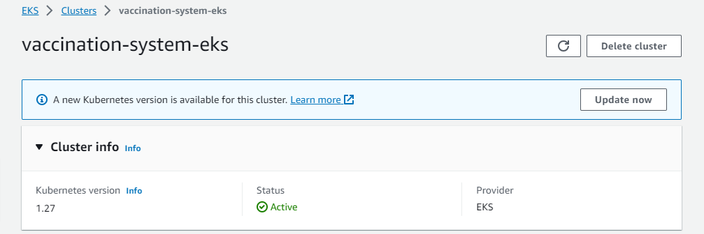

**Step 9:** Head over to `RDS` > `Databases` and there should be a RDS instance with the name `vaccination-rds`. Make note or copy the RDS endpoint address which will be needed in the later steps.

**Step 10:** Next, create an EC2 instance inside the same VPC as the EKS cluster. The VPC name should be `vaccination-vpc` which is created with terraform. Make sure to choose a public subnet to launch the EC2 as well. Use `Amazon Linux 2023` image.

**Step 11:** Connect to the EC2 and execute the following command to install `mariadb-server`

```bash
sudo yum install -y mariadb105-server
```

**Step 12:** After the installation, connect to the database
Make sure the replace the `rds-hostname` with the RDS endpoint previously found in **Step 9**.

```bash
mysql -h <rds-hostname> -u root --password='12345678'
```

**Step 13:** Next, run the following MySQL queries that will create two databases and create a new user named 'vms-user' grant access to the new databases;

```sql
-- Run as MySQL Root user

CREATE DATABASE registration;
CREATE DATABASE appointment;

CREATE USER 'vms-user' IDENTIFIED BY 'vms-password';

GRANT ALL PRIVILEGES ON registration.* to 'vms-user';
GRANT ALL PRIVILEGES ON appointment.* to 'vms-user';
FLUSH PRIVILEGES;
```

**Step 14:(Optional)** Make sure to change the root password to a new one as the default password set for the root user is not secure. Replace `<new-password>` with a strong password in the command below.

```sql
ALTER USER 'root'@'%' IDENTIFIED BY '<new-password>'; 
FLUSH PRIVILEGES;
```

### EKS-auth ConfigMap

**Step 1:** First, you need to get the `kubeconfig` file to communicate with the EKS control-plane. We can do so with the help of `aws-cli`. Run the following command to update the kubeconfig file. (Follow this step, if you haven't done this in Kubectl Setup before)

```bash
aws eks update-kubeconfig --name <eks-cluster-name> --region <aws-region-name>
```

**Step 2:** Copy and Paste this command in AWS Cli. Replace the 72101xxxxxxx with your Account ID and Vaccination-CodeBuildServiceRole with you newly created CodeBuild Service Role name.

```bash
ROLE="    - rolearn: arn:aws:iam::72101xxxxxxx:role/Vaccination-CodeBuildServiceRole\n      username: build\n      groups:\n        - system:masters"
```

**Step 2:** Update the auth configmap with new configuration in your AWS Cli setup.

```
kubectl get -n kube-system configmap/aws-auth -o yaml | awk "/mapRoles: \|/{print;print \"$ROLE\";next}1" > /tmp/aws-auth-patch.yml

kubectl patch configmap/aws-auth -n kube-system --patch "$(cat /tmp/aws-auth-patch.yml)"
```

## ECR (Elastic Container Registry) Setup

**Step 1:** Go over to ECR and create a private repository with a name of your choosing.

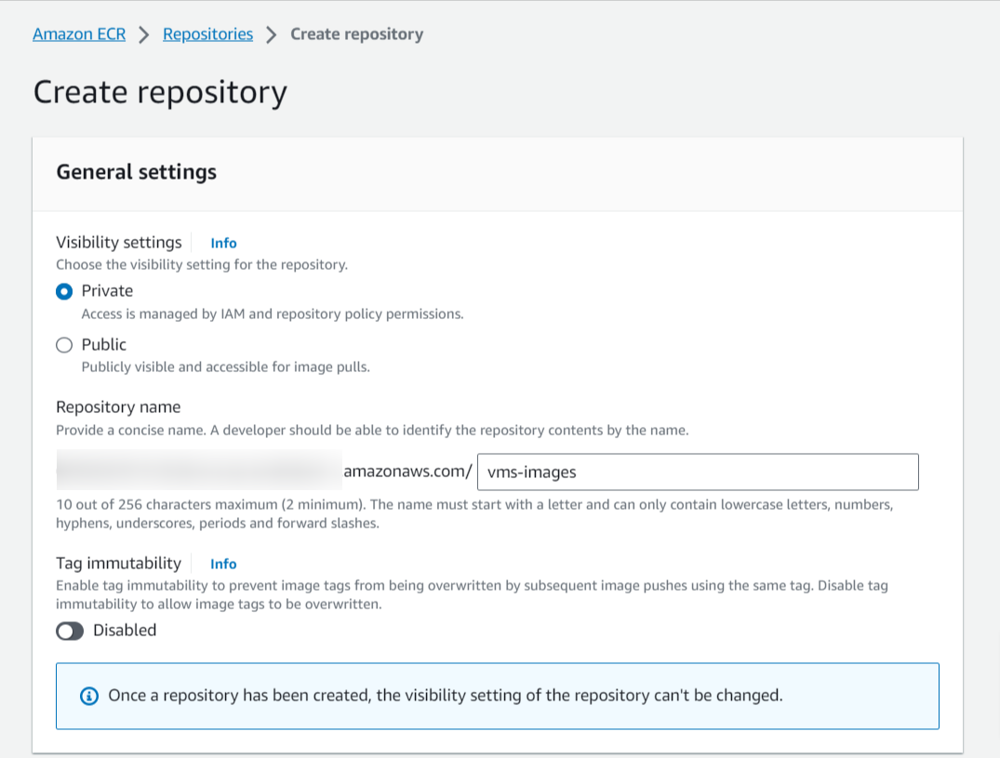

**Step 2:** Next, go to Permissions>Edit JSON Policy and delete the default and set the following permissions for the repository

```json
{
  "Version": "2012-10-17",
  "Statement": [
    {
      "Effect": "Allow",
      "Principal": "*",
      "Action": [
        "ecr:BatchGetImage",
        "ecr:DescribeImages",
        "ecr:GetDownloadUrlForLayer",
        "ecr:PullImage"
      ]
    }
  ]
}
```

## S3 Bucket Configuration

**Step 1:** Go over to S3 and create a private bucket for the project. Check if the settings matches the following screenshots and keep the defaults for rest of the configurations.

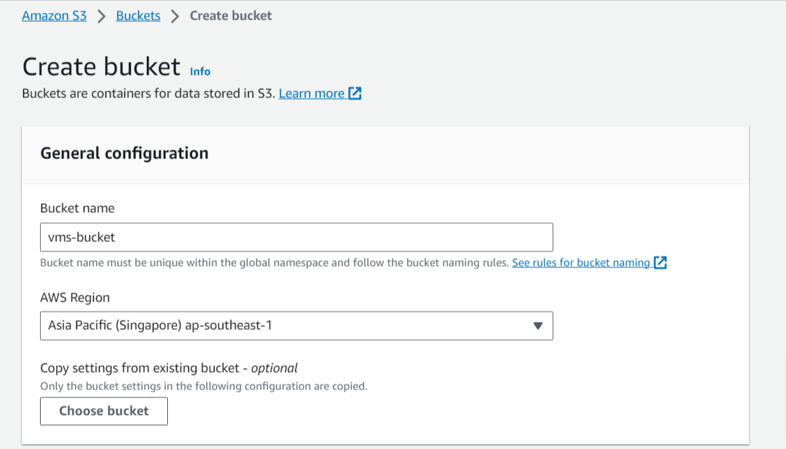

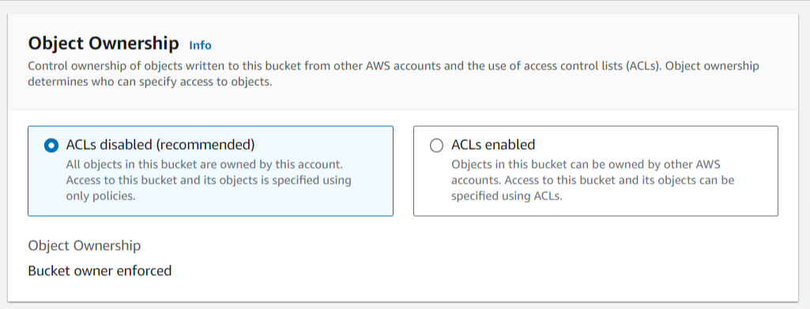

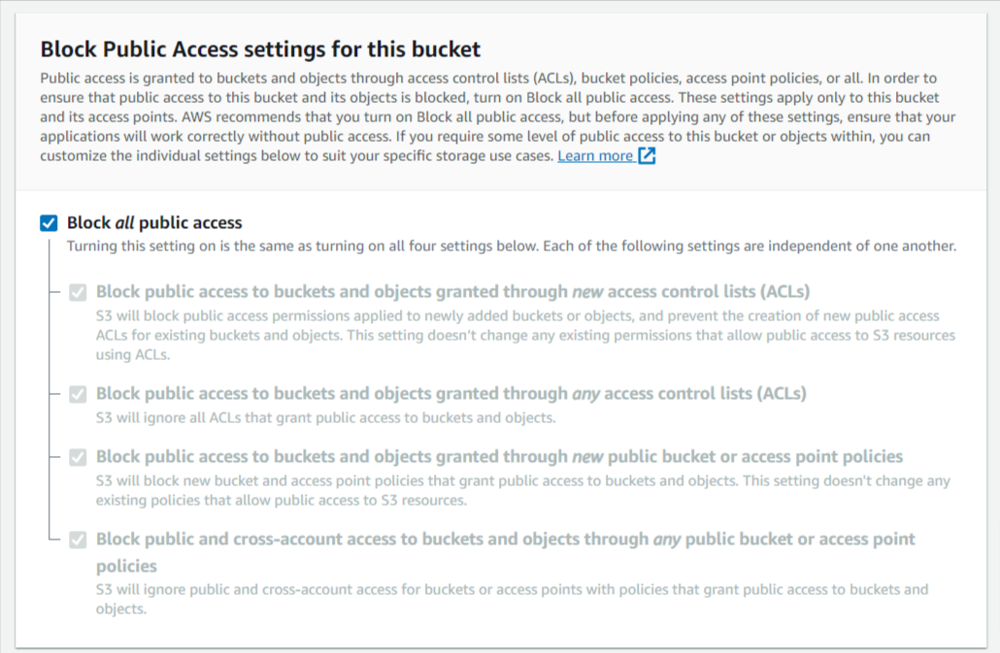

## Security Scan Logs collection with AWS Lambda

**Step 1:** First, create a lambda function named `ImportVulToSecurityHub`. Setting the name to the aforementioned value is crucial because inside each security tools scan buildspec file we will be invoking the function by name.

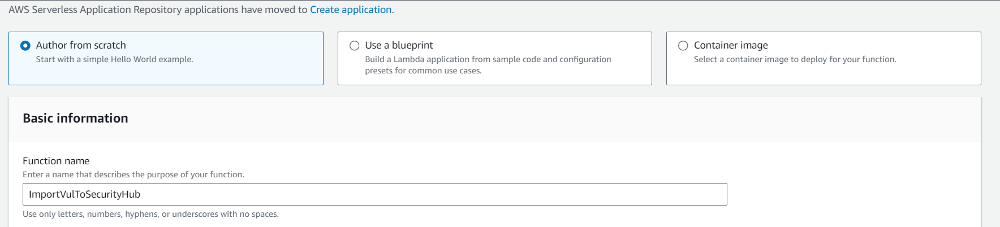

**Step 2:** Set `Python 3.9` as the runtime and `x86_64` as the architechture.

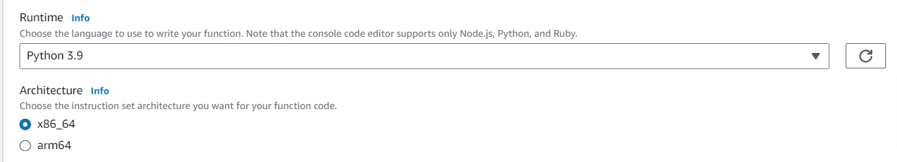

**Step 3:** Next, make sure that a new role is created along with the function

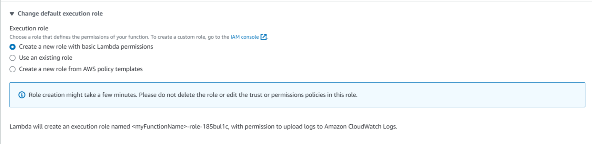

**Step 4:** Modify the new Lambda role and add `AmazonS3FullAccess` and `AWSSecurityHubFullAccess` policies.

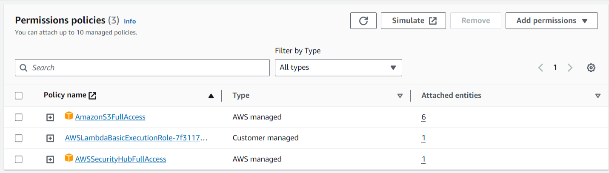

**Step 5:** Go into the lambda function you just created and click on **Upload From** and choose **.zip file** option.

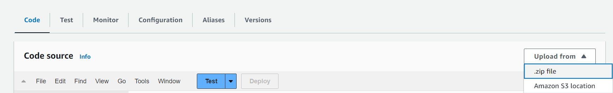

This should import the codes into two files one named `lambda_function.py` and another `securityhub.py`

* You can find the lambda function files in the github repository.

**Step 6:** Go over to **Configuration** and then **Environment Variables** and add a new variable with the key `BUCKET_NAME` and value set to the S3 bucket you choose to store your scan logs to. See the image below for reference.


**Step 7:** Finally, Deploy the function

## Security Hub

**Step 1:** Go to security hub > Click on  the button "Go to Security Hub"

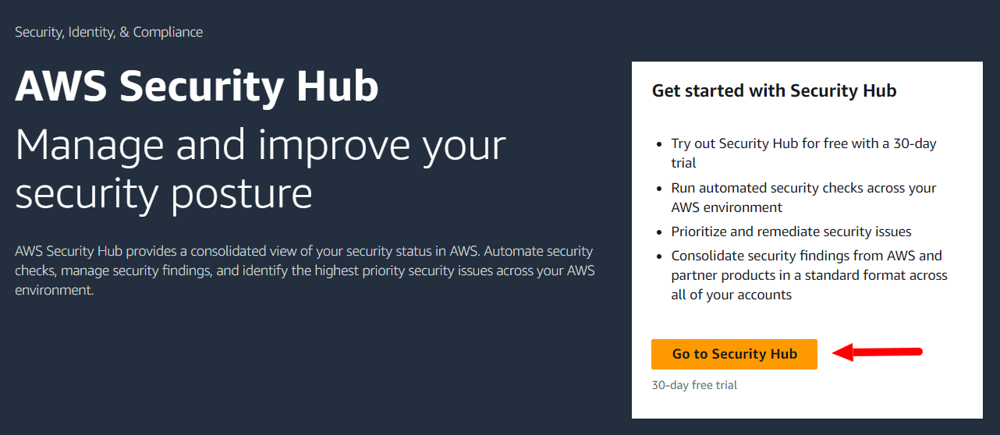

**Step 2:** Then, click on "Enable Security Hub" to connect the security hub with lambda.

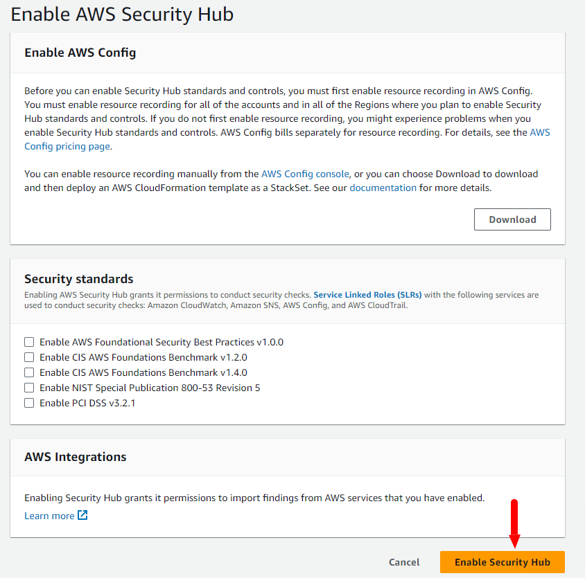 

## Notification Tools

### Simple Notification Service (SNS)

**Step 1:** First,Create a topic of SNS

  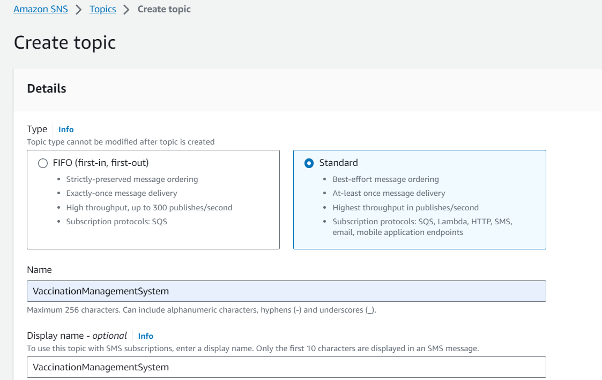

**Step 2:** Activate the Encryption policy according to the requirement which is optional.

  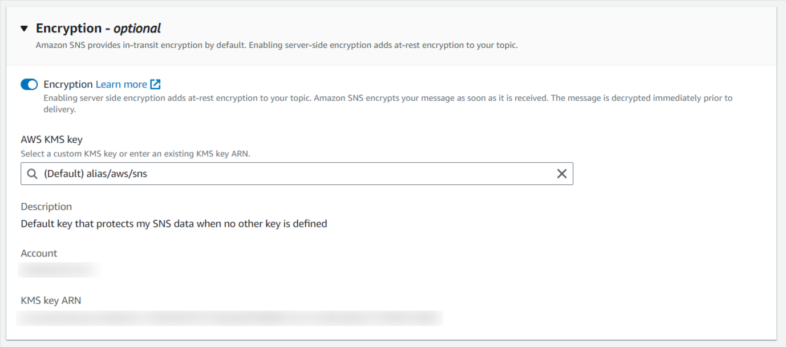

**Step 3:** After creating SNS topic, we get the TopicARN.

  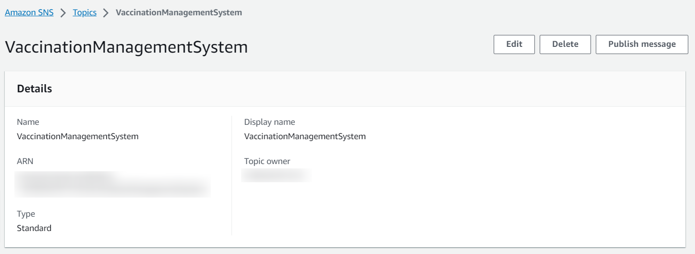  

**Step 4:** Create a subscription of the SNS's topics which will be used for sending the email.

  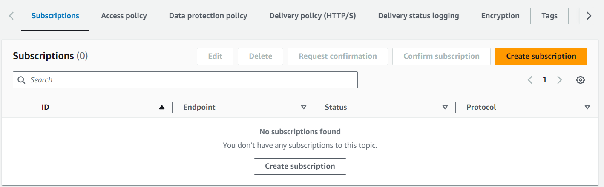

**Step 5:** Select the protocol type which will be used for the type of endpoint to subscribe.

  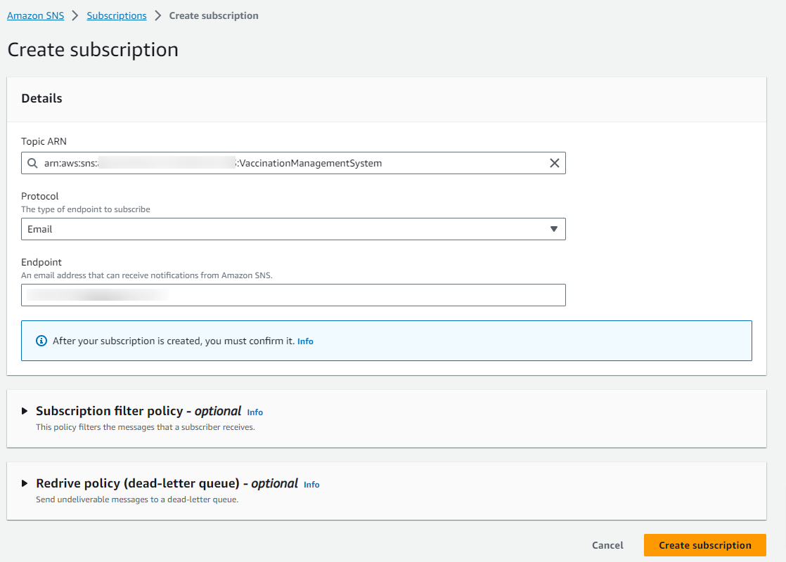

**Step 6:** Confirm the subscription endpoint for verification.

  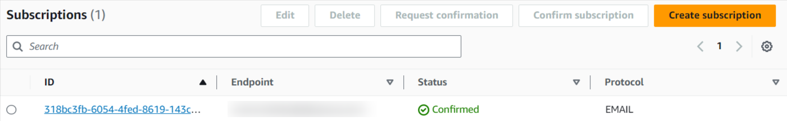 

### Simple Email Service (SES)

**Step 1:** Create a identity of SES.

  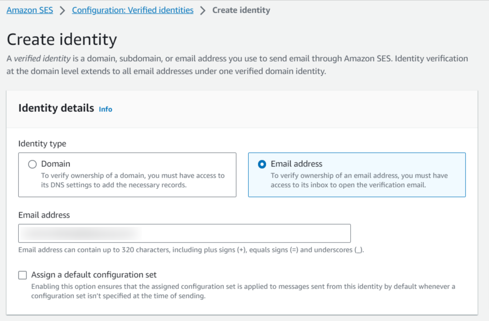

**Step 2:** Give an email which will be used for sending notification email.

  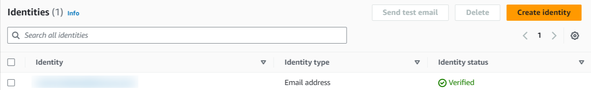

**Step 3:** Create SMTP credentials as IAM user which will auto generate SMTP user and SMTP password.

  

**Step 4:** After creating the credentials, we get the SMTP settings.

  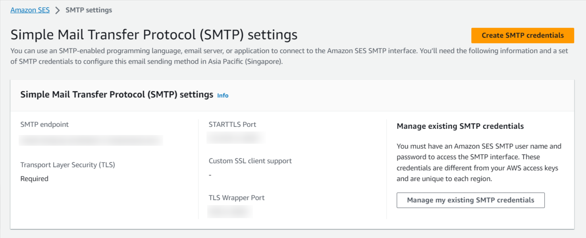

# The Pipeline

Our main objective in this project is to integrate Security into DevOps. We all know that the backbone of DevOps is a CI/CD Pipeline. The following image shows a basic outline of a typical DevSecOps pipeline.

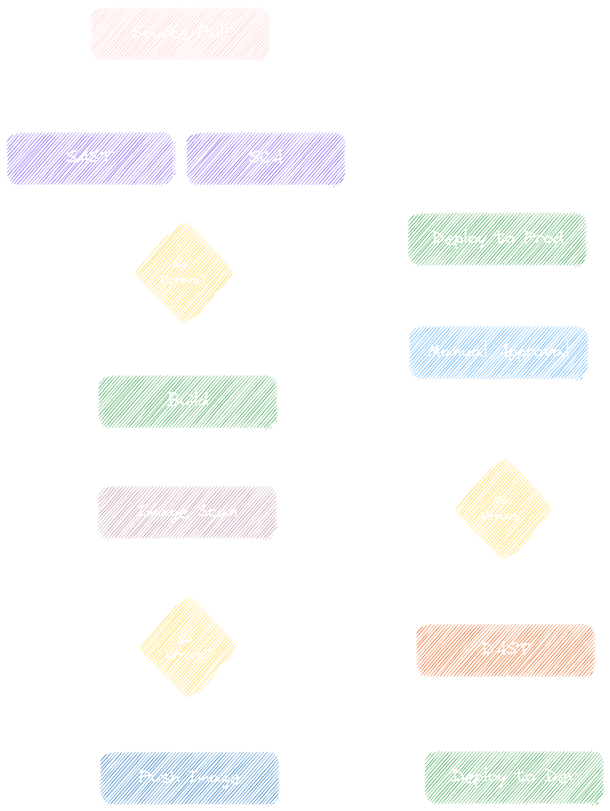 

CodePipeline Stages and Action Group

 **Source Stage**

- In this stage, source code will be fetched through the pipeline.
- You can find the source code in the repository.

 **SonarQube**

- This action group will be provided by CodeBuild Stage. You can find the process of creating a build project configuration file in the above section of "CodeBuild Project Configuration".
- Follow the CodeBuildProjectConfiguration process similarly to PHPStan, Dependency-Check and OWASP-ZAP.
- You can find the process of integrating this "SonarQube" tool in the repository.

 **PHPStan**

- This action group will be provided by CodeBuild Stage.
- You can find the process of integrating this "PHPStan" tool in the repository..

 **Dependency-Check**

- This action group will be provided by CodeBuild Stage.
- You can find the process of integrating this "Dependency-Check" tool in the repository.

 **Docker Image Build**

- You can find the process of creating a build project configuration file in the above section of "CodeBuild Project Configuration".

- You can also find the docker image build yaml file in the repository.

 **Docker Image Scan with Trivy**

- Follow the section of CodeBuild Project Configuration and scan the docker image with the SecOps tool (Trivy).
- You can find the buildspec file of trivy (docker image scan) in the repository.

 **Docker Image Push**

- Follow the section of CodeBuild Project Configuration and push the docker image to ECR.
- You can also find the docker image push yaml file in the repository.

 **Deploy to EKS Cluster**

- Follow the section of CodeBuild Project Configuration and deploy the manifest files to EKS cluster.
- You can find the kubernetes manifest files and buildspec file for deployment in EKS Cluster inside the repository.

 **OWASP-ZAP**

- This action group will be provided by CodeBuild Stage. You can find the process of integrating this "OWASP-ZAP" tool in "Security Tools" section.
- You can find the process of integrating this "OWASP-ZAP" tool in the repository.

`You can choose either GitHub configuration or CodeCommit configuration` 

## GitHub Conection

**Step 1:** First, Go to AWS Developer tools setting > Connection.

**Step 2:** Selec the connection provider > Give a name > Click on "Create Connection".

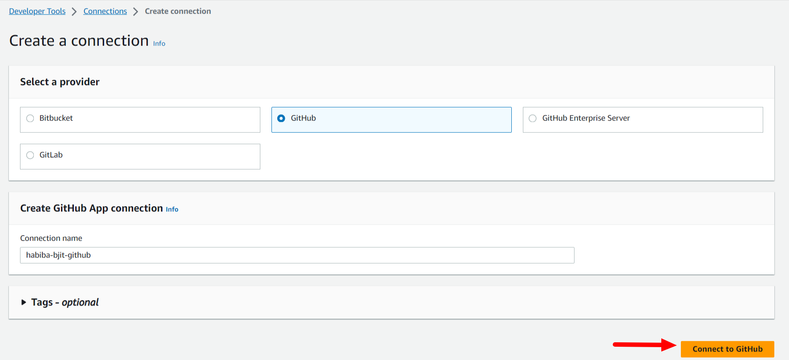

**Step 3:** By clicking on "Install apps", it will redirect you to your github account and you have to enter your github password and give acccess to your repository.

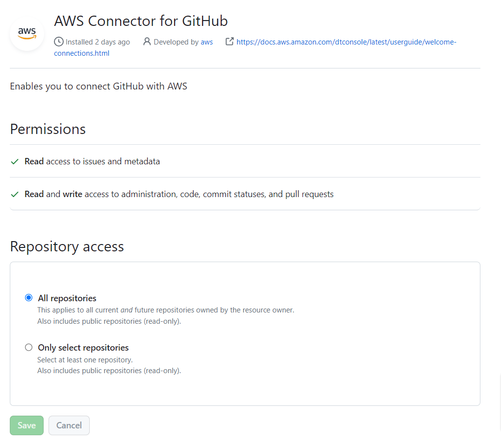

**Step 4:** Then, you will get your installed apps and you can authenticate your github connection.

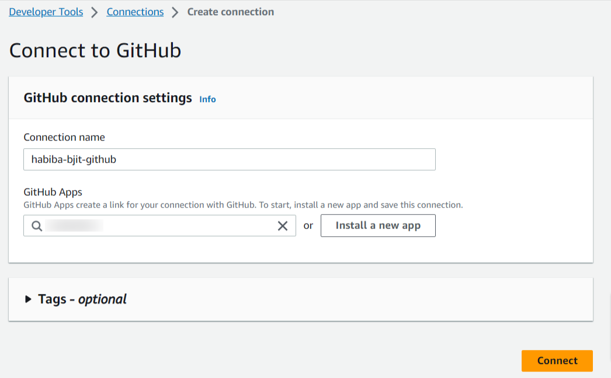

## CodeCommit Configuration

**Step 1:** Create an IAM User with AWSCodeCommitPowerUser policy.

**Step 2:** Create Repositories

**Step 3:** Add your SSH keys to the newly created user in Step 1 security credentials. Up to 5 SSH can be added per IAM user.

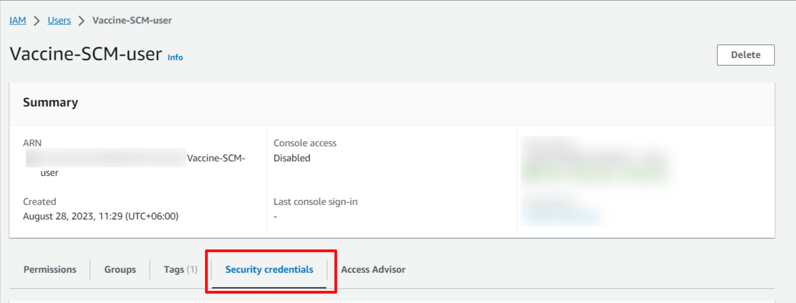

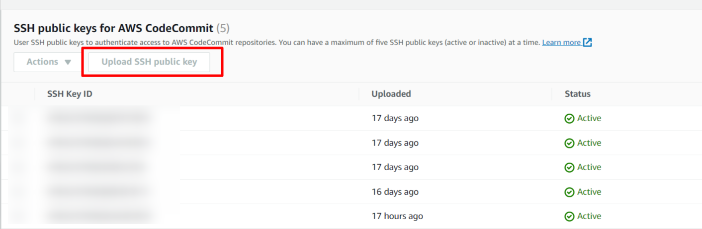

**Step 4:** Again under Security Credentials for HTTPS access to your repositories you need to generate git credentials for your account.

**Step 5:** Copy the username and password that IAM generated for you, either by showing, copying, and then pasting this information into a secure file on your local computer, or by choosing Download credentials to download this information as a .CSV file. You need this information to connect to CodeCommit.

**Step 6:** Check your connection by cloning one of the repositories.

## System Manager - Parameter Store

**Step 1:** Go to System Manager > Parameter Store > Create Parameter.

**Step 2:** Give a name of the parameter and choose the type, if you want to store the parameter as plain text then choose "String".

**Step 3:** if you want to store the parameter encyrpted then choose "SecureString". It will encrypt sensitive data using default KMS keys from your account.

* For this project, this parameters should be stored in System Manager > Parameter Store.

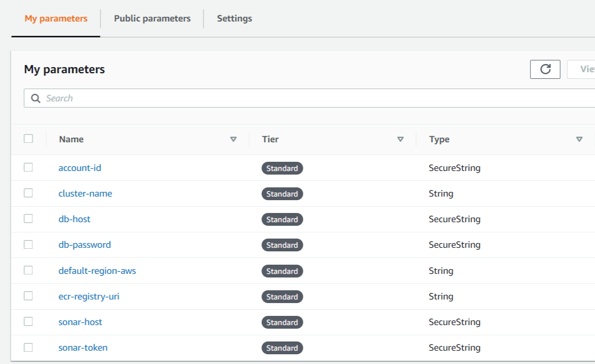

## CodeBuild Project Configuration

**Step 1**: Create a build project for the CodeBuild stage.

   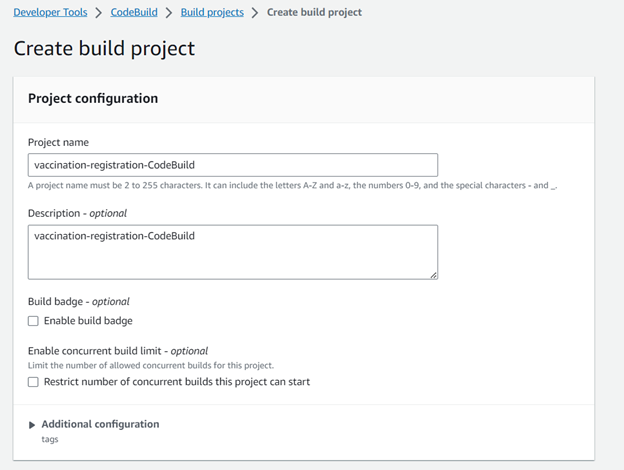

**Step 2:** Select the source provider, repository, and branch according to the AWS CodeCommit.

   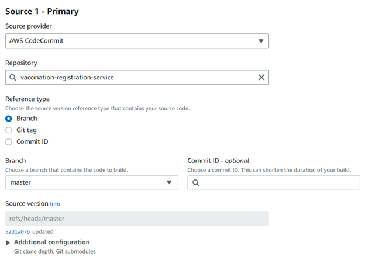

**Step 3:** Use the environment image for the runtime version of the container.

   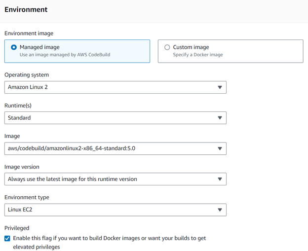

**Step 4:** Use the service role for the CodeBuild stage which is already created in the IAM service role configuration.

   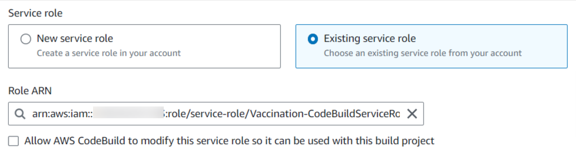

**Step 5:** Use a specific `buildspec` file containing the name which is stored in the AWS CodeCommit repository.

   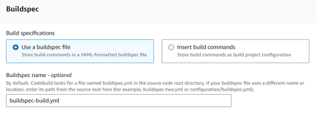

**Step 6:** Add `(no artifacts)` type in the Artifacts section.

   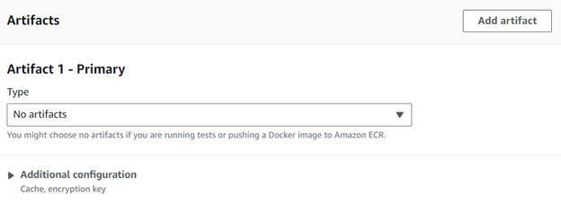

**Step 7:** In the S3 logs, select an existing bucket and choose the path prefix where this build project's logs output will be stored.

  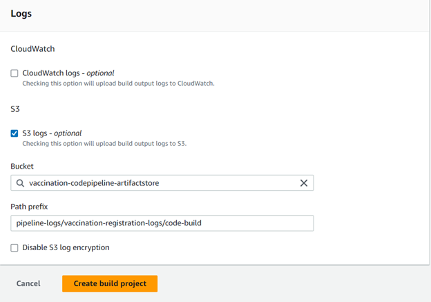

### CodeBuild Service Role

### Trust Relationship

1. Replace arn full path with your AWS CodeBuildServiceRole arn.

2. Make sure to correct the  ACCOUNT_ID with your AWS Account ID.

```json
{

    "Version": "2012-10-17",

    "Statement": [

        {

            "Effect": "Allow",

            "Principal": {

                "Service": "codebuild.amazonaws.com"

            },

            "Action": "sts:AssumeRole"

        },

        {

            "Effect": "Allow",

            "Principal": {

                "AWS": "arn:aws:iam::$ACCOUNT_ID:role/service-role/Vaccination-CodeBuildServiceRole"

            },

            "Action": "sts:AssumeRole"

        }

    ]

}
```

### IAM Permission Policies for CodeBuild

#### AWS Managed Policy

- AmazonSSMReadOnlyAccess

- AmazonEKSClusterPolicy

- AmazonS3FullAccess

#### Customer Managed Policy

- AmazonECRAccess

```json
{

  "Version": "2012-10-17",

  "Statement": [

    {

      "Effect": "Allow",

      "Action": [

        "ecr:GetAuthorizationToken",

        "ecr:GetDownloadUrlForLayer",

        "ecr:BatchCheckLayerAvailability",

        "ecr:GetRepositoryPolicy",

        "ecr:DescribeRepositories",

        "ecr:ListImages",

        "ecr:DescribeImages",

        "ecr:BatchGetImage",

        "ecr:InitiateLayerUpload",

        "ecr:UploadLayerPart",

        "ecr:CompleteLayerUpload",

        "ecr:PutImage"

      ],

      "Resource": "*"

    },

    {

      "Effect": "Allow",

      "Action": [

        "iam:CreateServiceLinkedRole"

      ],

      "Resource": "*",

      "Condition": {

        "StringEquals": {

          "iam:AWSServiceName": [

            "replication.ecr.amazonaws.com"

          ]

        }

      }

    }

  ]

}
```

- AmazonLambdaAccess
  
  1. Replace AWS _REGION with your selected Region of AWS Account where you will work.
  
  2. Replace arn full path with your AWS CodeBuildServiceRole arn in Resource section.
  
  3. Make sure to correct the ACCOUNT_ID with your AWS Account ID.

```json
{

    "Version": "2012-10-17",

    "Statement": [

        {

            "Effect": "Allow",

            "Action": [

                "lambda:InvokeFunction"

            ],

            "Resource": "arn:aws:lambda:$AWS_REGION:$ACCOUNT_ID:function:ImportVulToSecurityHub"

        }

    ]

}
```

- eks-codebuild-sts-assume-role
  
  1. Replace arn full path with your AWS CodeBuildServiceRole arn in Resource section.
  
  2. Make sure to correct the ACCOUNT_ID with your AWS Account ID.

```json
{

    "Version": "2012-10-17",

    "Statement": [

        {

            "Effect": "Allow",

            "Action": "sts:AssumeRole",

            "Resource": "arn:aws:iam::$ACCOUNT_ID:role/service-role/Vaccination-CodeBuildServiceRole"

        }

    ]

}
```

- EKSPermission

```json
{

  "Version": "2012-10-17",

  "Statement": [

    {

      "Effect": "Allow",

      "Action": [

        "eks:DescribeCluster",

        "eks:ListClusters"

      ],

      "Resource": "*"

    }

  ]

}
```

#### Auto Generated Policy

* This policy will be auto generated when you create a build project and click on new service role.

## CodePipeline Configuration

**Step 1:** Create a pipeline with a pipeline name and an existing service role for the pipeline, which is described in the IAM service role section.

   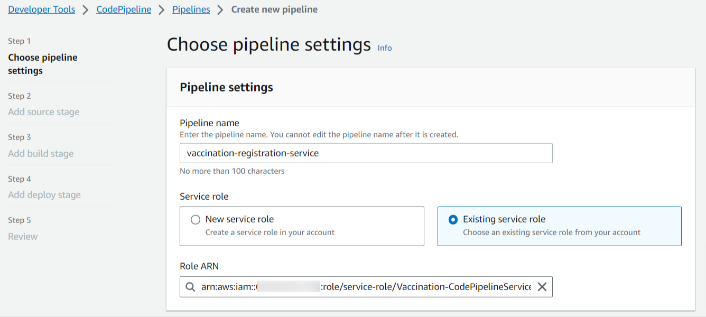

**Step 2:** Select the S3 bucket, and the encryption key will be the default AWS managed key.

   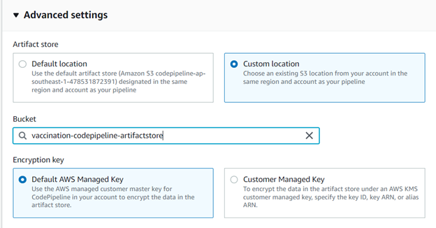

**Step 3:** Add a source stage and select the source provider, repository, and branch name. Other settings will be default.

   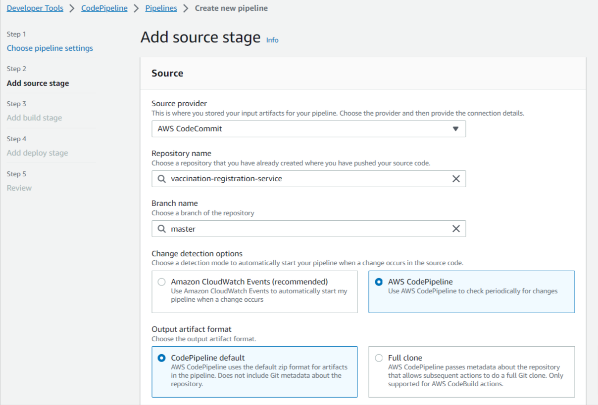

**Step 4:** Add a build stage and select the build provider, region, and build project, which is already created in the CodeBuild project configuration.

  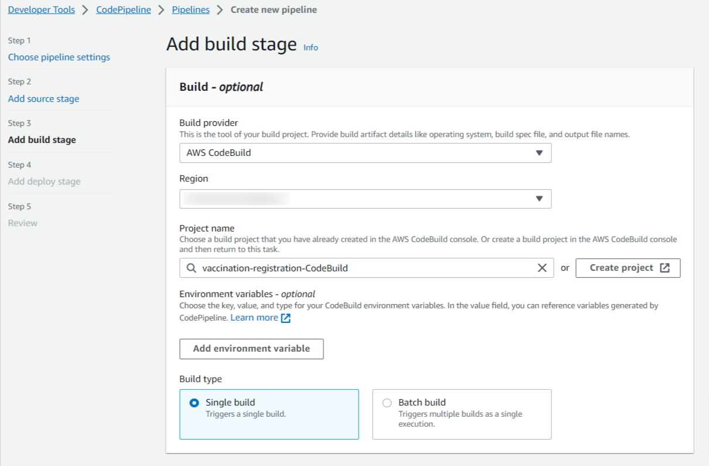

### CodePipeline Service Role

### Trust Relationship

```json
{

  "Version": "2012-10-17",

  "Statement": [

    {

      "Effect": "Allow",

      "Principal": {

        "Service": "codepipeline.amazonaws.com"

      },

      "Action": "sts:AssumeRole"

    }

  ]

}
```

### IAM Permission Policies for CodePipeline

#### Auto Generated Policy

* This policy will be auto generated when you create a build project and click on new service role.


#### Sonarqube Installation

**Step 1:** Java 11 installation steps

```bash
sudo apt-get update && sudo apt-get install default-jdk -y
```

**Step 2:** Postgres Installation

```bash
sudo sh -c 'echo "deb http://apt.postgresql.org/pub/repos/apt/ `lsb_release -cs`-pgdg main" >> /etc/apt/sources.list.d/pgdg.list'

sudo wget -q https://www.postgresql.org/media/keys/ACCC4CF8.asc -O - | sudo apt-key add -

sudo apt-get -y install postgresql postgresql-contrib

sudo systemctl start postgresql

sudo systemctl enable postgresql
```

**Step 3:** Login as postgres user

```bash
sudo su - postgres
```

**Step 4:** Now create a user below by executing below command

```bash
createuser sonar
```

**Step 5:**  Switch to sql shell by entering this command

```bash
psql
```

**Step 6:** Execute the below three lines (one by one)

```sql
ALTER USER sonar WITH ENCRYPTED password 'password';


CREATE DATABASE sonarqube OWNER sonar;


\q
```

(Exited from the shell)

Also, exit from postgres and return to Ubuntu user.

**Step 7:** Now install SonarQube Web App

```bash
sudo wget https://binaries.sonarsource.com/Distribution/sonarqube/sonarqube-7.7.zip

sudo apt-get -y install unzip

sudo unzip sonarqube-7.7.zip -d /opt

sudo mv /opt/sonarqube-7.7 /opt/sonarqube -v
```

**Step 8:** Create Group and User:

```bash
sudo groupadd sonar
```

**Step 9:** Now add the user with directory access

```bash
sudo useradd -c "user to run SonarQube" -d /opt/sonarqube -g sonar sonar

sudo chown sonar:sonar /opt/sonarqube -R
```

**Step 10:** Modify sonar.properties file

```bash
sudo vi /opt/sonarqube/conf/sonar.properties
```

* Uncomment the below lines by removing # and add values highlighted yellow

```bash
sonar.jdbc.username=sonar

sonar.jdbc.password=password
```

* Next, uncomment the below line, removing #

```bash
sonar.jdbc.url=jdbc:postgresql://localhost/sonarqube
```

(Press escape, and enter :wq! to come out of the above screen).

Edit the sonar script file and set RUN_AS_USER

```bash
sudo vi /opt/sonarqube/bin/linux-x86-64/sonar.sh
```

**Step 11:** Add enable the below line

```bash
RUN_AS_USER=sonar
```

**Step 12:** Create Sonar as a service(this will enable to start automatically when you restart the server)

* Execute the below command:

```bash
sudo vi /etc/systemd/system/sonar.service
```

* Add the below code in green color:

```bash
[Unit]

Description=SonarQube service

After=syslog.target network.target


[Service]

Type=forking


ExecStart=/opt/sonarqube/bin/linux-x86-64/sonar.sh start

ExecStop=/opt/sonarqube/bin/linux-x86-64/sonar.sh stop


User=sonar

Group=sonar

Restart=always


[Install]

WantedBy=multi-user.target
```

**Step 13:** Now, start the servcie

```bash
sudo systemctl start sonar


sudo systemctl enable sonar


sudo systemctl status sonar
```

**Step 14:**  (Now Restart EC2 instance by going to AWS console and stop/start the EC2 instance)  

* Once restarted EC2 instance, login again and check the Sonar logs:  

```bash
tail -f /opt/sonarqube/logs/sonar.log
```

* Make sure you get the below message that says sonarqube is up..

**Step 15:** Login to SonarQube server with Instance's IP Address and Port Number 9000 (SonarQube's port number)

```bash
Login Username: Admin

Login Password: Admin
```

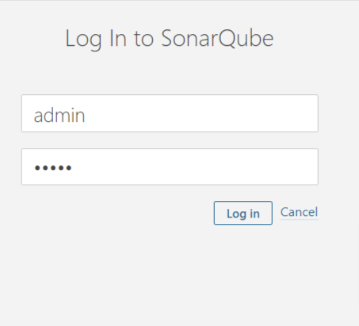

### SonarQube Project Setup

**Step 1:** Create a project and give a project name, click on setup

**Step 2:** Click on Generate a Token

  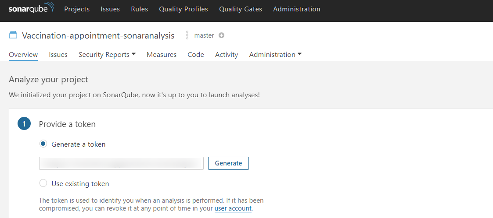

**Step 3:** Click on continue with the sonarqube token

  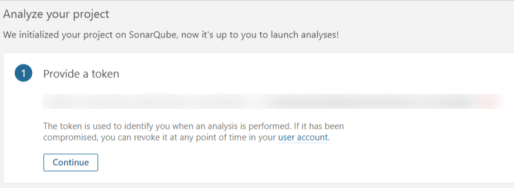

**Step 4:** Select the programming language of your application, and select the OS

  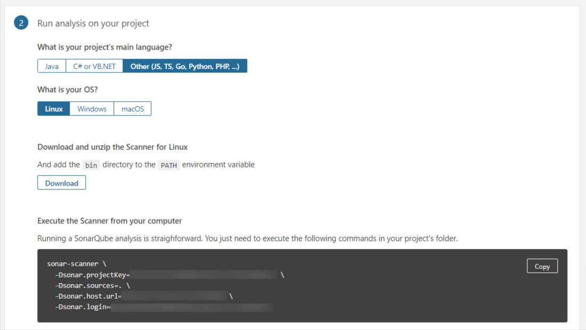

(Copy and save the generated information in a text editor).

### SonarQube Quality Gate Setup

**Step 1:** Go to Quality Gate and Create one.

  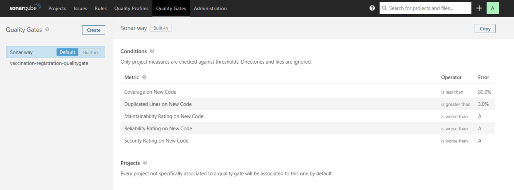

**Step 2: **Add a Quality Gate condition.

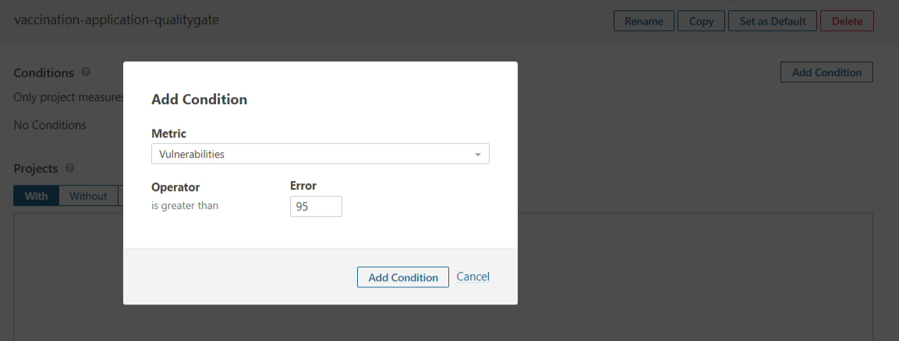

**Step 3:** Attach the quality gate with your new created project.

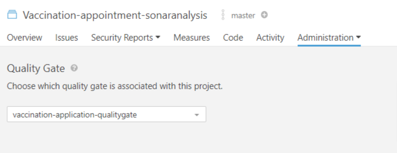

# Monitoring with Prometheus and Grafana

**Step 1:** Install `Helm3` in the system

```bash
curl -fsSL -o get_helm.sh https://raw.githubusercontent.com/helm/helm/main/scripts/get-helm-3

chmod 700 get_helm.sh

./get_helm.sh
```

**Step 2:** Next, install the `prometheus-community/kube-prometheus-stack` helm chart by running the following command(Assuming you have `kubectl` and kubeconfig configured). This will install a complete monitoring stack that includes `Prometheus`, `Grafana`, `Alertmanager`, `Node Exporter`, `Kube State Metrics` and `Prometheus Operator`.

```bash
helm repo add prometheus-community https://prometheus-community.github.io/helm-charts

helm install kube-prometheus-stack prometheus-community/kube-prometheus-stack -n prometheus --create-namespace
```

**Step 3:** Afterwards, check all the monitoring pods are up and running.

```bash
kubectl get pods -n prometheus
```

**Step 5:** Now by default the services that serves as the endpoint to the tools are defined as `ClusterIP` services. If we wnat to access them we need to perform port forwarding in order to access them.

```bash
nohup kubectl port-forward -n prometheus svc/kube-prometheus-stack-prometheus 85:9090 --address 0.0.0.0 &>/dev/null &

nohup kubectl port-forward -n prometheus svc/kube-prometheus-stack-grafana 86:80 --address 0.0.0.0 &>/dev/null &

nohup kubectl port-forward -n prometheus svc/kube-prometheus-stack-alertmanager 87:9093 --address 0.0.0.0 &>/dev/null &
```

**Step 6:** If the commands in the above step executed properly, we can view `Prometheus` at ['http://localhost:85'](http://localhost:85), `Grafana` at ['http://localhost:86'](http://localhost:86) and `AlertManager` at ['http://localhost:87'](http://localhost:87).

**Step 7:** Once all the pods are ready and running without any errors and the services are accessible, we can start applying our prometheus configurations. Go to the `prometheus` folder and apply each configurations.

```bash
kubectl apply -f PrometheusRule.yaml

kubectl apply -f AlertmanagerSecret.yaml
```

**Step 8:** Finally, perform a restart on the prometheus and alertmanager instances so that they get the updated configuration quickly.

```bash
kubectl -n prometheus rollout restart statefulset prometheus-kube-prometheus-stack-prometheus alertmanager-kube-prometheus-stack-alertmanager
```

# Autoscaling with metrics server

**Step 1:** Since we have defined a `HorizontalPodAutoscaler` for all of our deployments, it needs a metrics API endpoint to scale up/down depending on the metrics. We need to install the `metrics-server` in the same namespace as our deployments. Run the command below to install the `metrics-server` using helm.

```bash
helm repo add metrics-server https://kubernetes-sigs.github.io/metrics-server/

helm install metrics-server metrics-server/metrics-server -n prometheus
```
 
# Security Vulnerability Fixing Before / After


## **Docker Image Vulnerability scanning with Trivy (Before)**

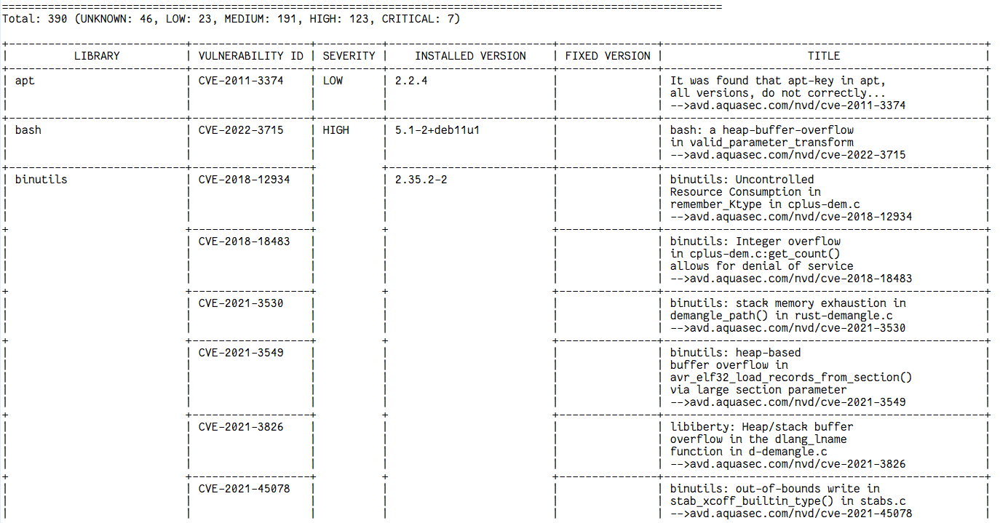

## **Docker Image Vulnerability Solve scanning with Trivy (After fixing Vulnerability)**

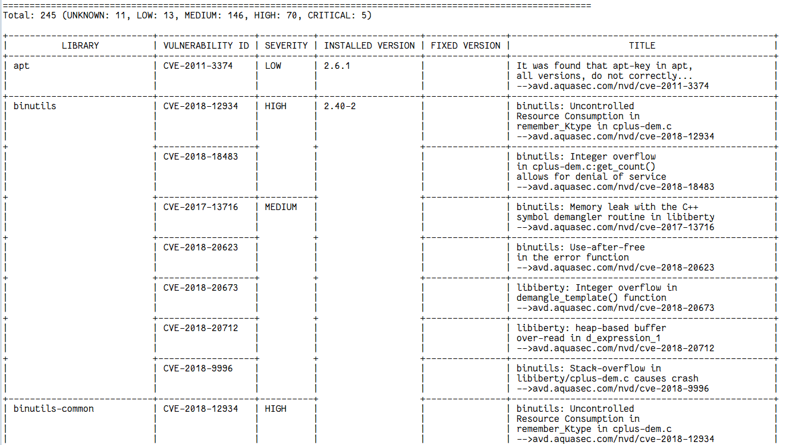

## **Docker Image scanning with Trivy (Pipeline Fail when Critical Vulnerability found)**


## **Quality Gate Condition checking Vulnerability with SonarQube (Pipeline Failed)**

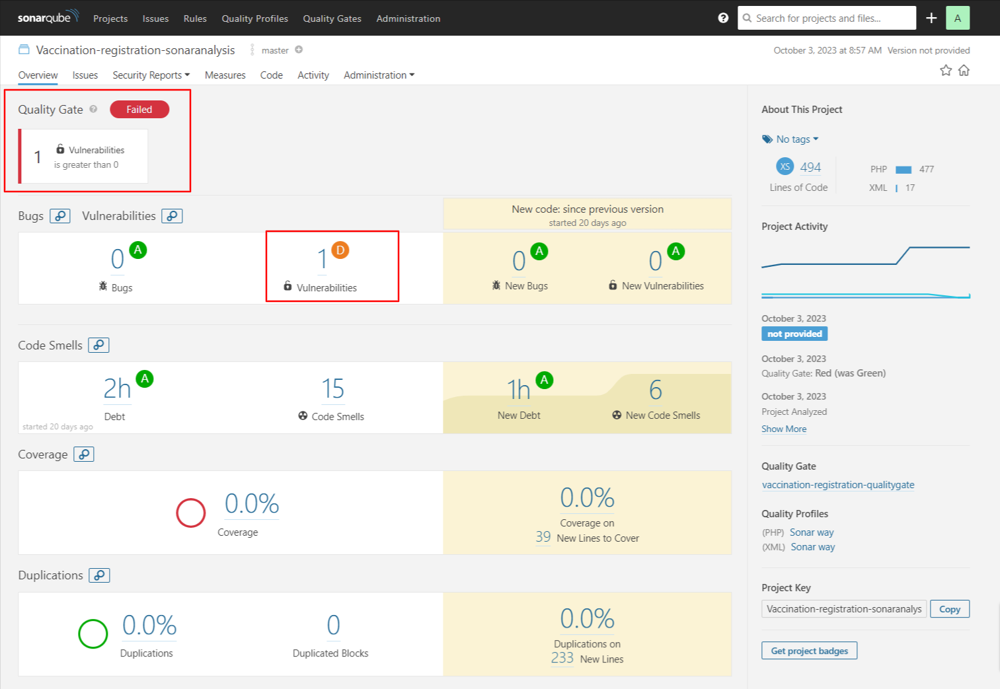

## **Quality Gate Condition checking Vulnerability with SonarQube (Pipeline Passed after fixing Vulnerability)**

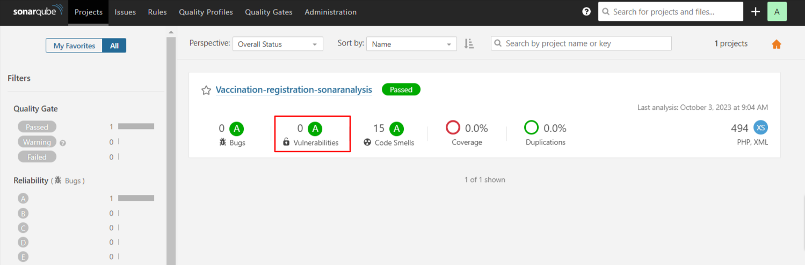

## **OWASP ZAP Report Before**

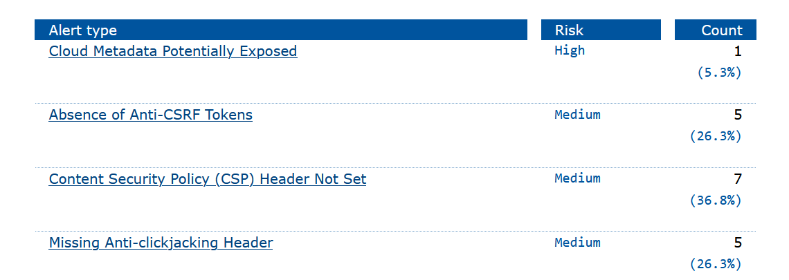

## **OWASP ZAP Report After**

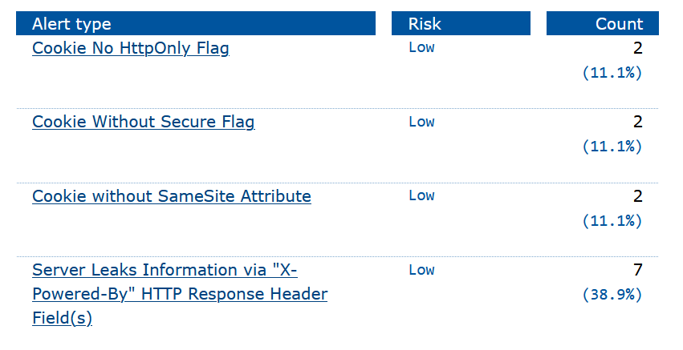

